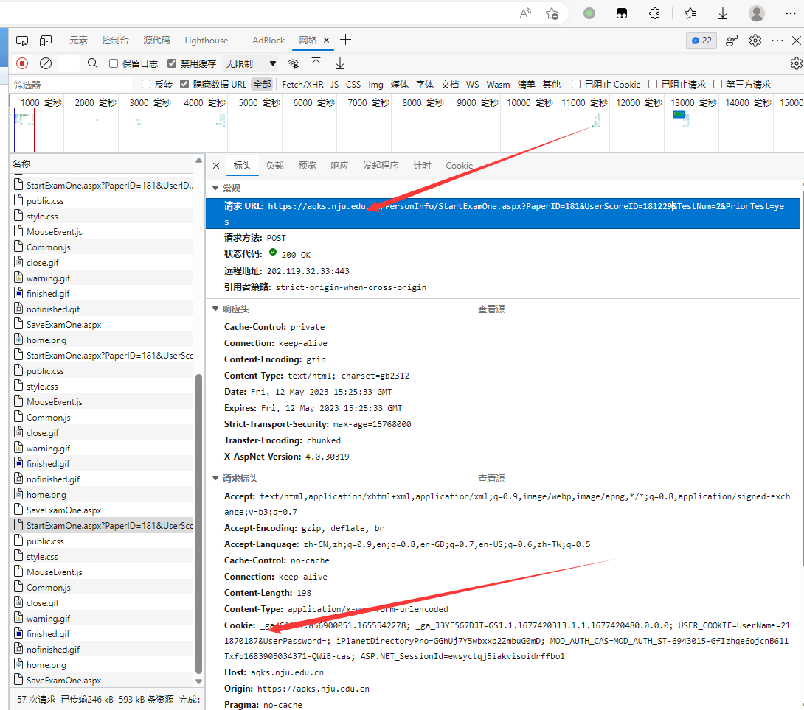

# FuckAspx

南京大学实验室安全教育与考试系统 自动生成答案

## 注意

目前题库是现工院的题库, 如果题库和现工院的不一样需要运行main.py爬取,再使用test.py

是现工院的题库则可以直接运行

## 使用方法

1. 先下载

2. 安装需要的模块

   ```
   pip install -r requirements.txt
   ```

   

3. 修改`test.py`

   1. 首先进入[实验室安全教育与考试系统 (nju.edu.cn)](https://aqks.nju.edu.cn/xycms.aspx)
   2. 进入考试, 按F12让选择网络(先进入考试, 不然包太多找不到)
   3. 考试中点下一题,然后在里面找到`StartExamOne.aspx?xxxxxxxxxxxxxx`这样的文件,如图




复制图上所示的,分别是url和cookie,其中url的形如`"https://aqks.nju.edu.cn/PersonInfo/StartExamOne.aspx?PaperID=xxx&UserScoreID=xxxx"`

例如,本图要复制的部分是

```python
url="https://aqks.nju.edu.cn/PersonInfo/StartExamOne.aspx?PaperID=xxx&UserScoreID=xxxx"
cookie="_ga=GA1.1.856900051.1655542278; _ga_J3YE5G7DJT=GS1.1.1677420313.1.1.1677420480.0.0.0; USER_COOKIE=UserName=211870187&UserPassword=; ASP.NET_SessionId=yaotkmvdpbn1sbxiloglbr0l; iPlanetDirectoryPro=bfcZclnajdD7NgecZgumcU; MOD_AUTH_CAS=MOD_AUTH_ST-4099384-21uKjPta2ep6HfbCAVYb1683879523185-0Mqp-cas"
```

修改test.py相应的变量

4.  修改num变量. num变量的意思是题目的数量
4. 运行test.py,然后扫描登录即可,最后输出所有的答案到控制台,同时保存在exam_ans.txt文件里面

## 其他文件

- `main.py`是爬虫脚本,爬取所有的试题
- `ans.txt`是题库(没有保存选项)
